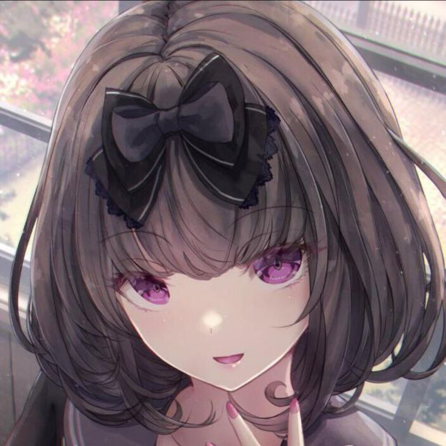
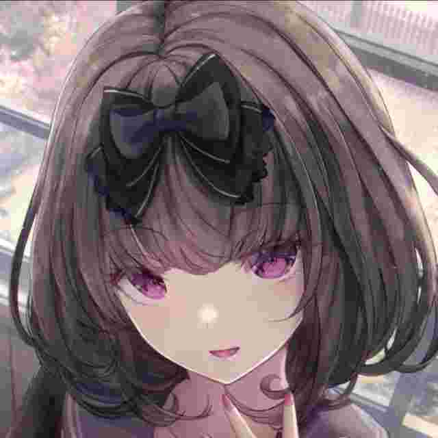

# Koishi Plugin - dialogue-image (图片问答)

本插件允许 Koishi 机器人识别用户发送的图片，并根据预设规则进行回复。它旨在提供类似 `dialogue` 插件的功能，但专注于以 **图片** 作为触发条件（问题）。

代码基本都是gemini 2.5 pro写的（gemini是mvp，我是躺赢狗

## 核心识别机制：感知哈希 (pHash) 与 MD5

本插件采用混合哈希策略来识别图片：

*   **感知哈希 (pHash) - 用于非 GIF 图片：**
    *   基于图片的**主要视觉特征**生成哈希值。
    *   **优点：** 对非结构性的编辑（如**压缩、格式转换、亮度/对比度调整、添加水印**）具有很强的**鲁棒性**。这意味着即使图片被社交平台压缩或者用户发送了不同清晰度的版本，只要视觉内容核心不变，通常都能被识别为同一张图片。感知哈希算法的性能开销也很低。
    *   **示例：** 下面两张图，左边是原图，右边是经过严重压缩的版本，它们的 pHash 是**完全相同**的，插件会将它们视为同一个问题：
        | 高质量原图                                       | 严重压缩图                                         |
        | :----------------------------------------------: | :------------------------------------------------: |
        |      |        |
    *   **缺点：** 对图片的**结构性变化非常敏感**，例如**裁剪**图片（即使只裁剪掉一小部分）通常会导致 pHash **完全不同**，从而无法匹配。旋转、翻转等操作也可能导致 pHash 变化。
*   **MD5 哈希 - 用于 GIF 图片：**
    *   基于文件的**二进制内容**生成哈希值。

## ✨ 功能特性

*   **图片作为问题**：核心功能，通过监听消息中的单张图片或包含图片的表情。
*   **混合哈希识别**：
    *   对 **非 GIF** 图片计算其 **感知哈希 (pHash)**，用于匹配规则，能识别视觉上相似的图片。
    *   对 **GIF** 图片计算其 **MD5 哈希**，用于匹配规则，需要文件内容完全一致。
*   **混合内容回复**：回复内容支持文本、Koishi 内置元素（如 at、表情等）以及图片。
*   **多回复与概率**：同一张问题图片可以关联多个不同的回复，并为每个回复指定触发概率。
*   **作用域控制**：支持设置全局问答或特定群组的问答。触发时，群组内优先匹配本群规则，若无匹配则尝试匹配全局规则。
*   **本地图片存储**：将作为问题和回答的图片下载并存储在配置的本地目录中（默认为 `data/imgqa_images`），使用 `file://` 协议引用，提高响应稳定性和速度。
*   **灵活的回复语法**：支持在回复内容中使用特殊占位符：
    *   `$$`: 输出一个普通的 `$` 符号。
    *   `$n`: 将回复内容在此处分割，后续部分作为新消息发送。
    *   `$a`: @消息发送者
    *   `$s`: 消息发送者的昵称或名称。
    *   `$g`: 消息发送者在本群的群名片（若无则同 `$s`）。
    *   `$m`: @机器人自身
*   **管理命令**：提供添加、查看、修改、删除、按哈希批量删除、查询问题图片、清理本地缓存等管理功能。

## ⚙️ 配置项

在 Koishi 配置文件或控制台中配置本插件：

*   **`storagePath`**:
    *   类型: `string`
    *   描述: 用于存储问题图片和回答中图片的本地路径。可以是绝对路径，也可以是相对于 Koishi 数据目录 (`data`) 的相对路径。
    *   默认值: `"imgqa_images"` (即 `data/imgqa_images`)
    *   **注意**: 请确保 Koishi 进程对该目录具有读写权限。插件启动时会尝试创建此目录。

## 📝 使用说明

### 基本逻辑

1.  当用户发送一条仅包含单张图片（或带图片的表情）的消息时，插件提取该图片。
2.  插件下载图片。
3.  插件判断图片类型：
    *   如果是 **GIF** 图片，计算其内容的 **MD5 哈希值**。
    *   如果是 **非 GIF** 图片，尝试使用 Jimp 库计算其 **感知哈希 (pHash)**。
4.  插件查询数据库，寻找与计算出的哈希值 (`imageHash`) 匹配的问答条目：
    *   若在群聊中，优先查找当前群组 (`guildId`) 的记录。
    *   若本群无匹配或在私聊中，则查找全局 (`guildId` 为空字符串) 的记录。
5.  如果找到一个或多个匹配的问答条目，插件根据每个条目设置的 `probability`（概率）随机选择一个进行回复。
    *   若匹配项概率总和大于 1，则会进行归一化处理后再抽取。
    *   概率为 0 或未选中任何项则不回复。
6.  发送选中的回复内容，并处理其中的特殊语法（`$a`, `$s`, `$g`, `$m`, `$n`, `$$`）。
7.  如果问题图片或回答中的图片在本地尚未存储，则将其保存到 `storagePath` 目录，并使用哈希值和推断的扩展名命名。

### 📌 命令列表

**注意：** 多数命令默认操作当前群组的问答。使用 `-g` 或 `--global` 选项可操作所有可访问范围的问答（通常需要权限 3）。

1.  **`imgqa.add` (别名: `添加图片回复`, `imgadd`, `教图`)**
    *   **功能**: 添加或更新一个图片问答。
    *   **用法**: **回复** 一张你想作为 **问题** 的图片，然后输入此命令及 **回答** 内容。
    *   **语法**: `imgadd [-p 概率] [-g | -t <群号>] <回答内容...>`
    *   **选项**:
        *   `-p <0-1>`: 设置此回复的触发概率（0 到 1 之间的小数），默认为 1.0。
        *   `-g, --global`: 将此问答设为全局生效（需要权限 3）。
        *   `-t, --target-guild <群号>`: 指定将问答添加到特定群组（需要权限 3）。**不能与 `-g` 同时使用**。
    *   **回答内容**: 可以包含文本、特殊语法占位符 (`$a`, `$s`, `$g`, `$m`, `$n`, `$$`)、Koishi 元素以及图片。若包含图片，会自动下载并转为本地 `file://` 引用。

2.  **`imgqa.list` (别名: `图片回复列表`, `imglist`, `图列`)**
    *   **功能**: 查看已添加的图片问答列表。
    *   **语法**: `imglist [-p 页码] [-s 每页条数] [范围选项]`
    *   **选项**:
        *   `-p <页码>`: 指定查看的页码（从 1 开始），默认 1。
        *   `-s <条数>`: 指定每页显示的条目数量，默认 10。
        *   `-G, --global-only`: 仅显示全局问答。
        *   `--guild-only`: 仅显示本群问答（需在群内使用）。
        *   `-a, --all`: 查看所有范围的问答（需要权限 3）。
    *   **默认行为**: 在群聊中显示本群及全局问答，在私聊中仅显示全局问答。
    *   **输出格式**: `ID:<ID> | hash:<哈希前缀> | [<范围>] | P:<概率> | A:<回答预览>` (范围可能是 `全局` 或 `群<群号>`)

3.  **`imgqa.delete` (别名: `删除图片回复`, `imgdel`, `删图`)**
    *   **功能**: 删除指定 ID 的图片问答。可以一次提供多个 ID，用逗号 `,` 分隔。
    *   **语法**: `imgdel [-g] <ID1,ID2,...>`
    *   **选项**:
        *   `-g, --global`: 操作所有可访问范围的问答（需要权限 3）。若无此选项，仅操作本群问答。
    *   **注意**: 默认只删除本群的问答。使用 `-g` 时会尝试删除所有匹配 ID 的记录，无论其归属哪个群组或全局。

4.  **`imgqa.delete.all` (别名: `删除图片全部回复`, `imgdelall`, `删全图`, `清图`)**
    *   **功能**: 删除与指定问题图片哈希（或哈希前缀）对应的 **所有** 回答记录。
    *   **语法**: `imgdelall [-g] <哈希或前缀>`
    *   **选项**:
        *   `-g, --global`: 操作所有可访问范围的问答（需要权限 3）。若无此选项，仅操作本群问答。
    *   **安全措施**:
        *   哈希前缀至少需要 `4` 个十六进制字符。
        *   如果提供的前缀匹配到 **多个不同** 的完整哈希值（在指定的操作范围内），操作将 **取消** 并提示用户，以防误删。只有当前缀能 **唯一确定** 一个完整哈希时，才会执行删除。
    *   **注意**: 默认只删除本群的问答。使用 `-g` 时会搜索所有范围。此操作将移除该图片哈希在指定范围内的所有问答。

5.  **`imgqa.query` (别名: `查询问答图片`, `imgget`, `查图`, `图ID`)**
    *   **功能**: 根据问答 ID 查询并显示其对应的 **问题** 图片。
    *   **语法**: `imgget [-g] <ID>`
    *   **选项**:
        *   `-g, --global`: 查询所有可访问范围的问答记录（需要权限 3）。
    *   **查找范围**: 默认在群聊中会查找本群和全局记录，私聊中只查找全局记录。使用 `-g` 选项可以查找所有范围的问答记录（需要权限 3）。
    *   **输出**: 发送一条包含问答信息（ID、范围、哈希前缀）和问题图片的消息。

6.  **`imgqa.modify` (别名: `修改图片回复`, `imgmod`, `改图`)**
    *   **功能**: 修改指定 ID 的图片问答的回答内容或触发概率。
    *   **语法**: `imgmod [-p 新概率] [-g] <ID> [新的回答内容...]`
    *   **选项**:
        *   `-p <0-1>`: 设置新的触发概率。
        *   `-g, --global`: 操作所有可访问范围的问答（需要权限 3）。若无此选项，仅操作本群问答。
    *   **用法**: 必须提供新的回答内容，或使用 `-p` 指定新概率，或两者都提供。
    *   **注意**: 若提供的新内容/概率与原记录相同，则不会执行修改。回答内容中的特殊语法同 `imgadd`。

7.  **`imgqa.clear` (别名: `清理图片缓存`, `imgclear`)**
    *   **功能**: 扫描配置的 `storagePath` 目录，并删除数据库中不再引用的本地图片文件。
    *   **语法**: `imgclear -y`
    *   **选项**:
        *   `-y, --confirm`: **必须** 添加此选项以确认执行。这是一个危险操作。
    *   **权限**: 需要权限 3。
    *   **警告**: 此操作会永久删除文件且不可逆，请谨慎使用。建议在执行前备份 `storagePath` 目录。

### 💡 核心概念

*   **作用域 (Scope)**: 每个问答记录通过 `guildId` 字段区分作用域。群号表示该群专属，空字符串 (`''`) 表示全局。
*   **图片哈希 (Image Hash)**:
    *   **感知哈希 (pHash)**: 用于 **非 GIF** 图片。基于图片的视觉内容生成，对微小的编辑（如缩放、压缩、水印）有一定抵抗力，能识别看起来相似的图片。本插件使用 Jimp 生成 pHash (hex 格式)。
    *   **MD5 哈希**: 用于 **GIF** 图片。基于文件的二进制内容生成，只有文件内容完全一致的 GIF 才会被视为相同。
*   **本地存储 (Local Storage)**: 插件将问题图片和回答中的图片下载到配置的 `storagePath` 目录下，通常以 `哈希值.扩展名` 命名。数据库 (`imageFilename` 字段) 和回复中通过 `file://` 协议引用这些本地文件。`imgqa.clear` 命令用于清理未被引用的文件。
*   **概率 (Probability)**: 当一张图片匹配到多个回答时，`probability` 字段（0 到 1 的小数）决定了每个回答被选中的相对机会。

### 🛡️ 权限

*   **默认权限 (Authority 1)**:
    *   `imgqa.add` (添加/更新本群问答)
    *   `imgqa.list` (查看本群/全局问答)
    *   `imgqa.delete` (删除本群问答)
    *   `imgqa.delete.all` (删除本群问答)
    *   `imgqa.query` (查询本群/全局问答图片)
    *   `imgqa.modify` (修改本群问答)
*   **需要权限 3 (Authority 3)**:
    *   使用 `-g` 或 `--global` 选项进行跨作用域的添加/删除/查询/修改 (`imgqa.add`, `imgqa.delete`, `imgqa.delete.all`, `imgqa.query`, `imgqa.modify`)。
    *   使用 `-t` 或 `--target-guild` 选项指定群组添加问答 (`imgqa.add`)。
    *   使用 `-a` 或 `--all` 选项查看所有范围的问答 (`imgqa.list`)。
    *   执行清理操作 `imgqa.clear`。

### ⚠️ 注意事项

*   图片匹配现在是混合模式：非 GIF 图片基于 pHash (视觉相似度，但仍较敏感)，GIF 图片基于 MD5 (精确内容)。
*   长期使用后，`storagePath` 目录可能占用较多磁盘空间，可适时使用 `imgqa.clear` 清理。
*   执行 `imgqa.clear` 命令前请务必理解其功能并确认操作，考虑备份。
*   感知哈希 (pHash) 计算依赖 `Jimp` 库，如果遇到无法处理的图片格式或库本身的问题，可能导致某些非 GIF 图片无法被学习或识别。
